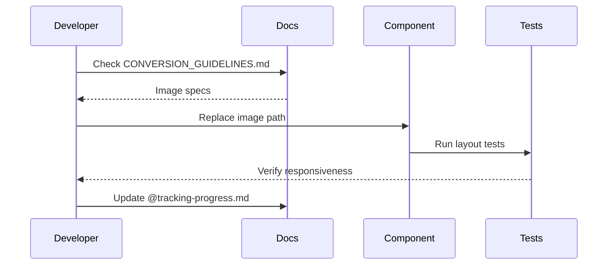

# Handyman v2 Conversion Guidelines

## Core Principles
1. Preserve original template layout/functionality
2. All changes must be made in copy directories, never in original template files
3. Image replacements maintain original dimensions + CSS classes

## Workflow
- Track all modifications in `@tracking-progress.md`
- Test layout after each image replacement
- Verify mobile responsiveness for all changes

## Image Replacement Workflow


## Component Conversion Process
```mermaid
flowchart TD
    A[Identify Component] --> B{Needs Conversion?}
    B -->|Yes| C[Analyze Original Implementation]
    B -->|No| D[Mark as Complete]
    C --> E[Plan Modifications]
    E --> F[Implement Changes]
    F --> G[Test Layout]
    G --> H[Update Documentation]
    H --> I[@tracking-progress.md]

```

## Special Scenarios
Refer to [Edge Cases Documentation](cci:7://file:///C:/Users/IvoD/repos/lead-gen-handyman/handyman-v2/documentation/edge-cases.md) for handling discontinued services and multi-location businesses.
