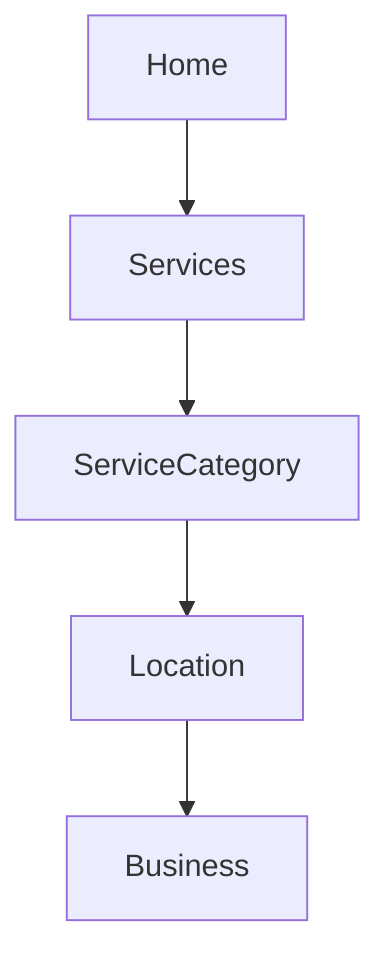
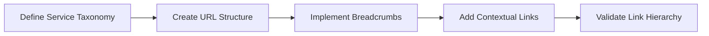

# Internal Linking Strategy

## Hierarchy Structure

## Linking Rules
- Business Pages: Link upward to Location+Service
- Location Pages: Link to Service+Businesses
- Service Pages: Link to Related Services

## Implementation Workflow

