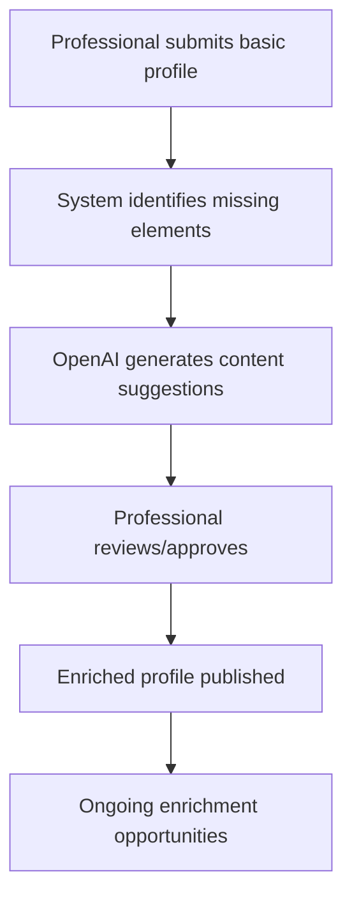

**Website Main Topic:** Handyman services in Placerville, California, and the greater Sacramento area (all cities).

**Data Source:** `handyman-categories-cities.csv`

**Internal Linking Structure:**

*   **1 Main Home Page:** `placervillehandyman.us`
    *   Rich content, SEO optimized, 3000+ words, 4-5 videos, FAQ, Schema.
    *   All “handyman categories” pages will link to the Home page contextually.
*   **Tier 2 Pages:** “Handyman categories” pages (e.g., gutter cleaning, door repair).
    *   Each category page links contextually to the Home page.
    *   SEO optimized content, 1500-2000 words per page.
*   **Tier 3 Pages:** “Category-city” pages (e.g., gutter cleaning north highlands ca, door repair sacramento ca).
    *   Unique content for each page, including city information.
    *   2-5 internal links per page: 10% to Home page, 50% to Tier 2 pages, 40% internal linking between Tier 3 pages.

**External Links:**

*   Tier 2 and Tier 3 pages to include 1-3 external links to authoritative construction sites (e.g., Wikipedia).

**SEO Optimization:**

Example URLs:


1. General Handyman Services Pages (Location-Based):
`placervillehandyman.us/handyman-services-placerville-ca`
`placervillehandyman.us/handyman-services-north-highlands-ca`
`placervillehandyman.us/handyman-services-sacramento-ca`
`placervillehandyman.us/handyman-services-roseville-ca`
`placervillehandyman.us/handyman-services-folsom-ca`
`placervillehandyman.us/handyman-services-el-dorado-hills-ca`
`placervillehandyman.us/handyman-services-cameron-park-ca`
(Add all other city variations here based on your CSV data)
2. Category Pages (Tier 2):
`placervillehandyman.us/gutter-cleaning`
`placervillehandyman.us/door-repair`
`placervillehandyman.us/siding-repair`
`placervillehandyman.us/window-installation`
`placervillehandyman.us/furniture-assembly`
(Add all other category variations here based on your CSV data)
3. Business Pages (With City Appended):
`placervillehandyman.us/ace-handyman-services-placerville-ca`
`placervillehandyman.us/ace-handyman-services-north-highlands-ca`
`placervillehandyman.us/ace-handyman-services-sacramento-ca`
`placervillehandyman.us/ace-handyman-services-roseville-ca`
`placervillehandyman.us/ace-handyman-services-folsom-ca`
`placervillehandyman.us/ace-handyman-services-el-dorado-hills-ca`
`placervillehandyman.us/ace-handyman-services-cameron-park-ca`
`placervillehandyman.us/pro-handyman-solutions-placerville-ca`
`placervillehandyman.us/pro-handyman-solutions-north-highlands-ca`
`placervillehandyman.us/pro-handyman-solutions-sacramento-ca`
`placervillehandyman.us/pro-handyman-solutions-roseville-ca`
`placervillehandyman.us/pro-handyman-solutions-folsom-ca`
`placervillehandyman.us/pro-handyman-solutions-el-dorado-hills-ca`
`placervillehandyman.us/pro-handyman-solutions-cameron-park-ca`
`placervillehandyman.us/reliable-repairs-inc-placerville-ca`
`placervillehandyman.us/reliable-repairs-inc-north-highlands-ca`
`placervillehandyman.us/reliable-repairs-inc-sacramento-ca`
`placervillehandyman.us/reliable-repairs-inc-roseville-ca`
`placervillehandyman.us/reliable-repairs-inc-folsom-ca`
`placervillehandyman.us/reliable-repairs-inc-el-dorado-hills-ca`
`placervillehandyman.us/reliable-repairs-inc-cameron-park-ca`
(Add all other business variations with each city here based on your CSV data)
4. Handyman Location Pages (Category-City Pages, Tier 3):
Gutter Cleaning:
`placervillehandyman.us/gutter-cleaning-placerville-ca`
`placervillehandyman.us/gutter-cleaning-north-highlands-ca`
`placervillehandyman.us/gutter-cleaning-sacramento-ca`
`placervillehandyman.us/gutter-cleaning-roseville-ca`
`placervillehandyman.us/gutter-cleaning-folsom-ca`
`placervillehandyman.us/gutter-cleaning-el-dorado-hills-ca`
`placervillehandyman.us/gutter-cleaning-cameron-park-ca`
(Add all other category + city variations here based on your CSV data)
Door Repair:
`placervillehandyman.us/door-repair-placerville-ca`
`placervillehandyman.us/door-repair-north-highlands-ca`
`placervillehandyman.us/door-repair-sacramento-ca`
`placervillehandyman.us/door-repair-roseville-ca`
`placervillehandyman.us/door-repair-folsom-ca`
`placervillehandyman.us/door-repair-el-dorado-hills-ca`
`placervillehandyman.us/door-repair-cameron-park-ca`
(Add all other category + city variations here based on your CSV data)
Siding Repair:
`placervillehandyman.us/siding-repair-placerville-ca`
`placervillehandyman.us/siding-repair-north-highlands-ca`
`placervillehandyman.us/siding-repair-sacramento-ca`
`placervillehandyman.us/siding-repair-roseville-ca`
`placervillehandyman.us/siding-repair-folsom-ca`
`placervillehandyman.us/siding-repair-el-dorado-hills-ca`
`placervillehandyman.us/siding-repair-cameron-park-ca`
(Add all other category + city variations here based on your CSV data)
Window Installation:
`placervillehandyman.us/window-installation-placerville-ca`
`placervillehandyman.us/window-installation-north-highlands-ca`
`placervillehandyman.us/window-installation-sacramento-ca`
`placervillehandyman.us/window-installation-roseville-ca`
`placervillehandyman.us/window-installation-folsom-ca`
`placervillehandyman.us/window-installation-el-dorado-hills-ca`
`placervillehandyman.us/window-installation-cameron-park-ca`
(Add all other category + city variations here based on your CSV data)
Furniture Assembly:
`placervillehandyman.us/furniture-assembly-placerville-ca`
`placervillehandyman.us/furniture-assembly-north-highlands-ca`
`placervillehandyman.us/furniture-assembly-sacramento-ca`
`placervillehandyman.us/furniture-assembly-roseville-ca`
`placervillehandyman.us/furniture-assembly-folsom-ca`
`placervillehandyman.us/furniture-assembly-el-dorado-hills-ca`
`placervillehandyman.us/furniture-assembly-cameron-park-ca`
(Add all other category + city variations here based on your CSV data)
Important Notes:
CSV Data: Ensure your `handyman-categories-cities.csv` file contains all the necessary categories, businesses, and cities. These examples are based on the small sample you provided.
Programmatic Generation: Remember that these URLs should be programmatically generated based on your CSV data. This will ensure consistency and reduce manual work.
Slugify: Use a "slugify" function to convert categories, business names, and city names into URL-friendly slugs (e.g., "Gutter Cleaning" becomes "gutter-cleaning").
Comprehensive List: Make sure this list is exhaustive, covering every possible combination from your CSV. This is vital for SEO


*   All articles to be 100% SEO optimized.
*   SEO juice from inner pages to flow up to the Home Page.

---

**General Instructions:**

*   Ensure all pages do not scroll horizontally on mobile.
*   No weird redirects or issues. Setup files should enable automatic builds.
*   Everything should be programmatically generated using Server Side Rendering (SSR) with efficient caching to minimize API calls.
*   Use `<index_page_examples>` and `<csv_data>` to understand page generation and JSON file creation.
*   Include all tags from the CSV in the JSON, plus tags created by “gpt-4o-mini”. My API key is: \[YOUR API KEY HERE]
*   Use Next.js 14.2.23.
*   Create icons and SVGs.
*   Do not use the `src` directory.
*   File paths to be included in comments at the top of each code file.
*   Implement ISR (Incremental Static Regeneration).
*   Use NextJS, shadcn, and Tailwind.
*   Be careful with TypeScript errors.
*   Handle null or malformed API responses.
*   Ignore existing data during builds.
*   Create separate JSON files for each page.
*   Use `generateStaticParams` correctly.
*   Ensure efficient build times to avoid timeouts.
*   Maximize build efficiency, speed, complexity, and modularity for SEO.
*   Create consistent data visualizations.
*   Programmatically implement slugs and internal links.
*   Split sitemaps into 5,000 URLs per file with a sitemap index page.
*   Statically generate the website for GitHub Pages deployment (no `.gitignore`).
*   Programmatically generate meta titles, descriptions, title tags, H1-H2 tags, etc.
*   Use AI to generate tags and category pages. All pages should abuse exact phrase match for Google ranking.
*   Use dynamic combinations of services/cities but carefully.
*   Target long-tail keywords and abuse exact phrase match for Google ranking.
*   Ensure unique, high-quality content on all pages.
*   Build a strong internal linking structure.
*   Detailed SEO, abusing exact phrase match for Google ranking (e.g., “What is the meaning and Origin of X name”).
*   Be mindful of TypeScript errors and null/malformed responses. Optimize build time with error logs.
*   Maximize GPT-4o-mini API usage (500 calls/minute).
*   Use GPT-4o-mini’s JSON mode, filling the prompt with CSV data and objects.
*   Combine CSV data and JSON responses from OpenAI in a templated, programmatic SEO format with icons, boxes, and shading for modular pages.
*   Visualize consistent data from CSV or JSON files across pages.

---

# Profile Enrichment Strategy

## Overview

This document outlines the strategy and implementation guidelines for enriching professional profiles in the Handyman v2 platform using OpenAI integration. Profile enrichment enhances the quality and completeness of service provider profiles, improving user experience and search relevance.

## Objectives

1. **Improve Profile Completeness**: Fill gaps in professional profiles with AI-generated content
2. **Enhance Service Descriptions**: Create compelling service descriptions based on minimal input
3. **Generate Consistent Formatting**: Ensure all profiles maintain consistent quality and structure
4. **Support SEO Optimization**: Generate SEO-friendly content that aligns with our [SEO mapping](cci:7://file:///C:/Users/IvoD/repos/lead-gen-handyman/handyman-v2/documentation/seo-mapping.md) strategy

## Implementation

### 1. Profile Enrichment Workflow



### 2. OpenAI Integration

#### API Configuration
```javascript
// utils/openai-client.js
import { OpenAIApi, Configuration } from 'openai';

const configuration = new Configuration({
  apiKey: process.env.OPENAI_API_KEY,
});

export const openai = new OpenAIApi(configuration);
```

#### Content Generation Function
```javascript
// utils/profile-enrichment.js
import { openai } from './openai-client';

export async function enrichProfileDescription(basicInfo) {
  const { name, services, experience, location } = basicInfo;
  
  const prompt = `
    Create a professional profile description for ${name}, a handyman professional 
    based in ${location} with ${experience} years of experience. 
    They specialize in: ${services.join(', ')}.
    Write in first person, highlight expertise, and keep it under 200 words.
  `;
  
  const response = await openai.createCompletion({
    model: "gpt-4",
    prompt: prompt,
    max_tokens: 300,
    temperature: 0.7,
  });
  
  return response.data.choices[0].text.trim();
}
```

### 3. Enrichment Fields

| Field | Source | Enrichment Strategy |
|-------|--------|---------------------|
| Profile Description | User input + AI | Generate complete paragraph from bullet points |
| Service Descriptions | Service selection + AI | Create detailed service descriptions |
| Specializations | User selection + AI | Expand on selected specializations |
| Experience Highlights | User input + AI | Format and enhance experience entries |
| FAQ Section | AI generated | Create common questions and answers |

### 4. User Experience

- **Transparency**: Clearly indicate AI-assisted content to professionals
- **Control**: Allow professionals to edit or reject AI suggestions
- **Iterative**: Provide options to regenerate content if not satisfied

### 5. Quality Assurance

- **Content Review**: Implement periodic review of AI-generated content
- **Feedback Loop**: Collect professional feedback on content quality
- **Improvement Metrics**: Track engagement with enriched vs. basic profiles

## Integration with Other Systems

### SEO Integration

- Ensure generated content follows [SEO mapping](cci:7://file:///C:/Users/IvoD/repos/lead-gen-handyman/handyman-v2/documentation/seo-mapping.md) guidelines
- Include location-specific keywords for better local search performance
- Generate meta descriptions for professional profile pages

### Edge Case Handling

- Address [multi-location businesses](cci:7://file:///C:/Users/IvoD/repos/lead-gen-handyman/handyman-v2/documentation/edge-cases.md#multi-location-businesses) with location-specific profile variations
- Handle professionals offering [discontinued services](cci:7://file:///C:/Users/IvoD/repos/lead-gen-handyman/handyman-v2/documentation/edge-cases.md#discontinued-services) with appropriate alternatives

## Implementation Timeline

1. **Phase 1**: Basic profile enrichment (descriptions and services)
2. **Phase 2**: Advanced enrichment (specializations, experience formatting)
3. **Phase 3**: Interactive elements (FAQ generation, testimonial formatting)

## Technical Requirements

- OpenAI API integration (GPT-4 recommended)
- Rate limiting to manage API costs
- Caching strategy for generated content
- Approval workflow for content moderation

## Example Implementation

See the [implementation examples](cci:7://file:///C:/Users/IvoD/repos/lead-gen-handyman/handyman-v2/documentation/implementation-examples.md) document for code snippets and component examples.

## Metrics and Success Criteria

- **Profile Completeness**: Increase average profile completeness by 40%
- **User Engagement**: 25% increase in profile page time-on-site
- **Conversion Rate**: 15% improvement in service inquiry rate
- **Professional Satisfaction**: 80% approval rate of AI-generated content
